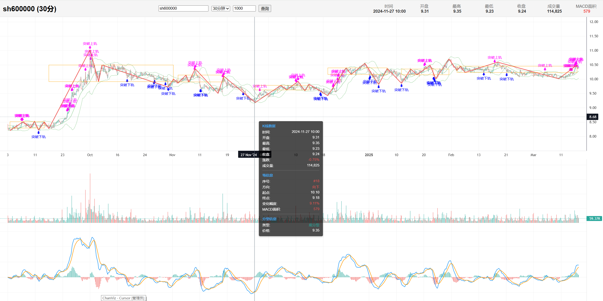
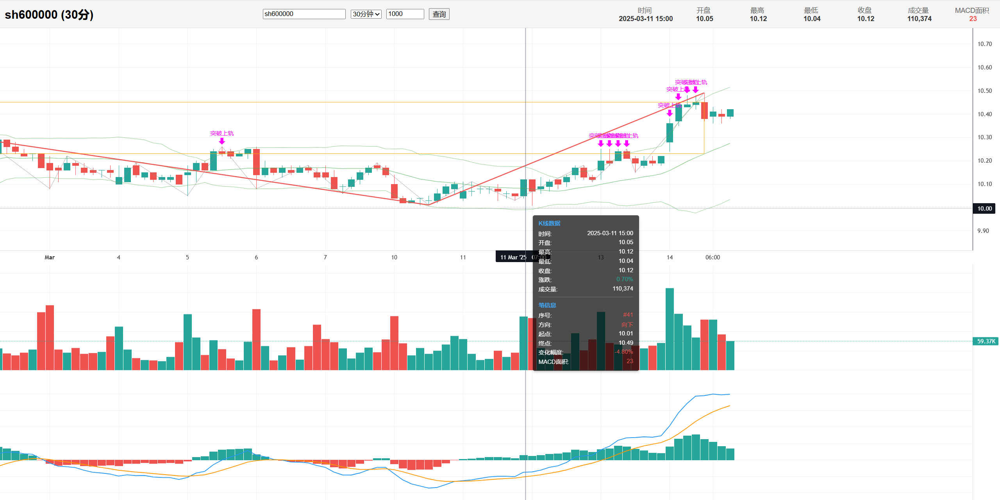

# 缠论分析可视化系统

这是一个基于Flask和轻量级图表库(Lightweight Charts)的股票数据分析和可视化系统，主要用于缠论技术分析和可视化展示。系统支持K线数据的加载、缠论分析（笔、分型、中枢）以及技术指标（MACD、布林带）的计算和展示。**特别强调其高度可扩展性设计**，用户可以通过简单继承基类实现数据和显示的自定义。

## 开发目的

我是一个缠论技术的爱好者，但是想量化绘制缠论的技术指标没有寻到可适用的可视化的开发平台，所以就想做一个可视的接口(前后端数据分离)，通过扩展改写api接口数据的方式就可以可视笔、中枢，画图等，最大的优点就是去继承TestFramework类，你就可以修改到每一根bar的数据以及算法，修改好后就可以发送到前端展示了。

## 申明一下

该项目全程使用cursor生成，遇到问题和bug自行下载cursor提问解决。


## 项目特点

- 基于缠论理论的股票技术分析
- 实时计算和显示技术指标（MACD、布林带）
- 可视化展示笔、分型、中枢等缠论分析结果
- **高度可扩展的测试框架**，支持自定义数据处理和前端显示
- 完整的前后端架构，前端采用轻量级图表库实现高性能渲染
- **灵活的数据拦截机制**，可在任何环节修改分析结果

## 系统展示

### 图表展示


### 分析结果


## 文件结构

```
project/
├── api/                      # API模块目录
│   ├── __init__.py           # API初始化文件
│   ├── chart_processor.py    # 图表数据处理模块
│   ├── data_service.py       # 数据服务模块（获取和分析数据）
│   ├── indicators.py         # 技术指标计算模块
│   ├── logger_config.py      # 日志配置
│   ├── test_framework.py     # 测试框架基类
│   └── test_manager.py       # 测试类管理
├── czsc/                     # 缠论分析核心库
│   ├── analyze.py            # 缠论分析核心算法
│   ├── objects.py            # 缠论对象（K线、笔、分型、中枢）
│   └── ...                   # 其他缠论相关模块
├── gp_data/                  # 股票数据模块
│   ├── csv/                  # 股票CSV数据存储
│   └── stock_data_reader.py  # 股票数据读取工具
├── templates/                # 前端模板目录
│   └── index.html            # 主页面（包含图表和交互逻辑）
├── test/                     # 测试用例目录
│   ├── my_test.py            # 保存扩展示例供参考(重要)
├── logs/                     # 日志目录
├── app.py                    # 主应用入口
├── test.py                   # 自定义测试类实现
└── README.md                 # 项目说明文档
```

## gp_data数据获取

数据需要自行购买，我也是购买的，看有需要就购买，没有就自行构建该数据格式(后期计划再加每天数据自行维护的模块)。
淘宝：
【淘宝】https://e.tb.cn/h.6hQ7CtWfGxq7PhR?tk=9K3WVZVMdH2 CZ225 「股票历史数据沪深A股历史K线分时日周月季年数据实时更新」
点击链接直接打开 或者 淘宝搜索直接打开

## 我所学习的缠论视频教程

【超级会员】通过百度网盘分享的文件：0021-缠论博…
链接:https://pan.baidu.com/s/15bSpmRJDcCPh29yqmP2Zhw?pwd=93x1 
提取码:93x1
复制这段内容打开「百度网盘APP 即可获取」

## 数据流程

1. **数据获取**：通过`data_service.py`从`gp_data/csv`目录读取股票数据
2. **数据处理**：
   - 使用`indicators.py`计算技术指标（MACD、布林带）
   - 使用`czsc`库进行缠论分析（识别笔、分型、中枢）
3. **数据转换**：通过`chart_processor.py`将分析结果转换为前端可用的JSON格式
4. **数据测试/修改**：使用`test_framework.py`和`test.py`中的自定义测试类处理数据
5. **数据展示**：前端通过`index.html`将数据可视化展示

## API接口

### 1. 主页面 (`/`)

- **方法**：GET
- **参数**：
  - `code`: 股票代码，默认"sh600000"
  - `freq`: K线类型，如"日"、"周"、"月"等
  - `limit`: 获取K线数量，默认1000
- **功能**：渲染主页面，加载初始图表

### 2. K线数据API (`/api/kline`)

- **方法**：GET
- **参数**：
  - `code`: 股票代码，默认"sh600000"
  - `freq`: K线类型，如"日"、"周"、"月"等
  - `limit`: 获取K线数量，默认1000
  - `test_class`: 可选，指定使用的测试类
- **返回**：JSON格式数据，包含：
  - `bars`: K线数据，包含OHLC、成交量和技术指标
  - `bi_list`: 笔数据，包含方向和MACD面积
  - `fx_list`: 分型数据
  - `zs_list`: 中枢数据
  - `bar_markers`: K线标记数据（如金叉死叉等）

## 自定义测试框架

系统最大的特点是提供了一个**高度可扩展的测试框架**，让用户可以根据自己的需求自由修改和扩展数据处理流程，灵活控制显示到前端的数据：

1. **TestFramework**：核心基类，定义了数据处理的标准接口
   - 可以在数据传递到前端前拦截和修改任何类型的数据
   - 支持K线数据、笔、分型、中枢等所有分析结果的自定义处理
   - 可添加自定义标记和信号到图表中

2. **MyTest**：示例实现，提供多种功能：
   - `process_single_bar`：查看/修改单个K线数据，可调整价格、成交量或添加指标
   - `process_single_bi`：查看/修改笔数据，可调整笔的方向、强度等属性
   - `process_single_zs`：查看/修改中枢数据，可调整中枢的范围、特性等
   - `process_fx_list`：查看/修改分型数据，可过滤或强化特定分型
   - `process_single_bar_marker`：为K线添加自定义标记，如金叉、死叉、突破等信号

### 扩展示例

用户可以通过继承`TestFramework`类来实现数据的自定义处理：

```python
# 示例：创建自定义测试类
class MyCustomTest(TestFramework):
    @classmethod
    def process_single_bar(cls, bar):
        # 修改K线数据，例如调整收盘价
        if 'close' in bar:
            bar['close'] = round(bar['close'] * 1.05, 2)  # 提高5%
        return bar
    
    @classmethod
    def process_single_bar_marker(cls, bar):
        # 添加自定义K线标记
        markers = []
        # 示例：布林带突破判断
        if 'indicators' in bar and 'boll' in bar['indicators']:
            boll = bar['indicators']['boll']
            # 要求突破必须超过K线长度的一半
            k_line_length = bar['high'] - bar['low']
            half_k_line_length = k_line_length / 2
            
            if 'upper' in boll and bar['high'] > boll['upper'] and (bar['high'] - boll['upper']) >= half_k_line_length:
                markers.append({
                    'dt': bar['dt'],
                    'position': 'above',
                    'text': '突破上轨',
                    'color': '#FF00FF'
                })
        return markers
```

将自定义测试类添加到系统：

```python
# 在app.py中导入自定义测试类
from my_custom_test import MyCustomTest

# 注册测试类
from api.test_manager import TestManager
TestManager.set_default_test_class(MyCustomTest)
```

## 前端图表

前端使用轻量级图表库(Lightweight Charts)实现高性能的图表渲染，主要包括：

1. **K线图**：显示股票价格走势，支持缩放和平移
2. **成交量图**：显示交易量信息
3. **MACD图**：显示MACD技术指标
4. **布林带**：在K线图上叠加显示布林带指标
5. **缠论标记**：
   - 笔：连接分型高低点的线段
   - 分型：顶底分型标记
   - 中枢：缠论中枢区域标记
   - 技术指标信号：如MACD金叉死叉标记

## 使用方法

1. 启动应用：
   ```
   python app.py
   ```

2. 在浏览器中访问：
   ```
   http://localhost:8000
   ```

3. 在页面上方输入股票代码、选择K线类型和数量，点击"查询"按钮加载数据

4. 通过鼠标操作可以：
   - 滚轮缩放图表
   - 拖动平移图表
   - 悬停查看详细数据
   
5. 自定义数据处理：
   - 创建继承自`TestFramework`的自定义类
   - 重写需要的方法来实现数据处理逻辑
   - 在URL参数中指定`test_class`参数来使用自定义类

## 缠论分析说明

本系统实现了基于缠论的股票分析，主要包括：

1. **分型识别**：识别K线组合形成的顶分型和底分型
2. **笔的划分**：连接分型形成缠论定义的笔
3. **中枢识别**：通过笔的组合识别缠论中枢
4. **MACD面积**：计算每个笔的MACD面积，用于强度分析

## 开发扩展

系统设计支持多方面的扩展：

1. **技术指标扩展**：在`api/indicators.py`中添加新的技术指标
2. **数据处理扩展**：通过继承`TestFramework`创建自定义测试类
3. **前端展示扩展**：修改`templates/index.html`中的图表渲染逻辑
4. **数据源扩展**：增加新的数据源连接器
5. **信号系统扩展**：添加新的交易信号识别和标记方式

通过`test`目录中的示例可以了解如何进行各种扩展开发，系统的模块化设计使得扩展开发变得简单直观。 